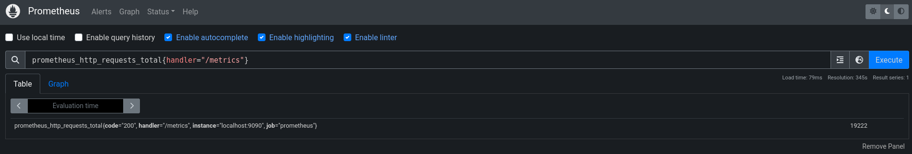
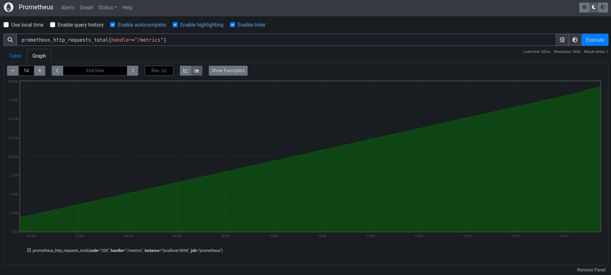

+++
title = 'First Hands With Prometheus'
date = 2024-03-26T17:41:50+01:00
draft = false
ShowToc = true
ShowCodeCopyButtons = true
ShowReadingTime = true
ShowShareButtons = true

[cover]
image = "images/cover.png"
+++

As an SRE/DevOps Engineer, most of my work is heavily relying on some kind of monitoring solution. Knowing this I'm always interested in seeing what new solutions have to offer.

To this day, and to the exception of SignalFX (now called Splunk Infrastructure Monitoring), I've always worked with basic and kind of old school solution such as Nagios, Zabbix, Centreon or CheckMK. Because now I'm working in a more cloud oriented job I wanted to see what was about the well-known "cloud native" solution that is Prometheus. 

## What Is Prometheus

Just like every time I want to see what's what, my first instinct of course is to go to the official website, or better a Wikipedia page. Fortunately for us the solution is popular enough that it got a great Wikipedia page.

From this page we can learn that Prometheus is an "application used for event monitoring and alerting". The first version of Prometheus has been released 11 years ago, and is since 2016 being backed by the Cloud Native Foundation (CNCF) as a graduated project.

On a more technical aspect, the solution is written in Go, and store every data inside of a time series database, with an engine based on a pull process (it means that it gathers data from an endpoint, instead of being filled by an application, which would be the case on a push aspect).

The solution comes with it's own query language, called PromQL (for Prometheus Query Language). It allows you to run query inside of the actual time series database.

When we dig deeper we can see that there is actually multiples "components" that makes Prometheus.. Prometheus.

- Alertmanager : This component is used for handling all of the alerting side of Prometheus. It's this engine that will check the value of a metrics, and based on defined rules, will, or not, send an alert, clear one...

- Exporters : This is not one component, but multiples ones. Most of the time we have one exporter per application. For example we have an exporter for Nginx, one for Varnish or even Apache. Their goal is to scrap metrics on the application, and to export them as a format that can be pulled by Prometheus.

- Grafana : Grafana is used for creating beautiful dashboards using data stored inside of Prometheus. It is a pretty known solution, and is not developed by the same team as Prometheus, but work has been done so that Grafana can be used with Prometheus.


## Getting It Up And Running

In this blog post I just want to set-up a really simple proof of concept, just to see how easy it is to install the solution, and monitor different application I'm running on my home lab. I will call it a success if I'm able to have a simple solution running with good looking dashboards.

As always the best way to get started on how to install something, is to go read the official documentation. In the case of Prometheus I found the documentation to be really really good. It is complete, and easy to navigate, with all of the information where we expect it.

### Installation

There is multiples way you can install Prometheus : From the official binaries you can download from the website, building your own binaries (which can be fairly easy since the solution is written in Go) or using Docker. In my case I will install it using Docker as it is easier for me to do because of my home lab already running some containers.

If you're using a configuration management tool (which you should !) such as Ansible or Puppet, well good news for you : there is both an Ansible role, and a Puppet module available.


The official documentation about how to run Prometheus inside of Docker is fairly straight forward. In my case, and since they're will multiple components, I chose to write a Docker compose file. 

The two things we have to keep in mind when running Prometheus with Docker is passing the configuration file, and the volume for storing Prometheus data. If you don't, all the data will be lost once the container restart.

With the following Docker compose we have a fully working Prometheus service, ready to scrape data from exporters or others sources.

```yaml
version: '3'

services:
  prometheus:
    image: prom/prometheus
    ports:
      - 9090:9090
    volumes:
      - ./prometheus.yml:/etc/prometheus/prometheus.yml
      - prometheus-data:/prometheus

volumes:
  prometheus-data:
```

We also obviously need a configuration file. In the case of Prometheus, just like any tools in 2023 it seems, the configuration format used is YAML. In the Prometheus documentation there is a small configuration that just get us started. It defines the basic of the configuration, such as the global scrape interval. Most importantly it also defines a job inside of the `scrape_configs`, in this case it's to scrape the data of Prometheus itself.

```yaml
global:
  scrape_interval: 15s
  external_labels:
    monitor: 'prometheus01'

scrape_configs:
  - job_name: 'prometheus'
    scrape_interval: 5s
    static_configs:
      - targets: ['localhost:9090']
```

And just like that, after a small `docker compose up -d` we have a fully working Prometheus installation ! Another thing that is great about Prometheus is that it also comes with a simple web interface that will help you get started on basics, especially trying out PromQL.


### Exploring time series

Inside of Prometheus we have time series. A time series is a numerical value that evolves in time. In our case for the `prometheus` job define in the configuration, the `scrape_interval` is set to 5 seconds. This mean that our time series is appended with the new current value every 5 seconds. 

The `prometheus` job will scrape data on the Prometheus instance itself. I will use this data to get used to the PromQL syntax. First thing I want to do is to see every time series that exists on the current instance, to see what I can query to train myself.

As always, internet is my friend, so I just asked "How to find every time series on the instance" and the internet promptly responded to me the following request :

```
{__name__!=""}
```

This is a basic PromQL request that will return all the time series where the field `name` is not empty. In our case it's kind of a loop hole, but it will effectively return all the time series.

Doing so I was able to find a time series called `prometheus_http_requests_total`. There is actually multiples time series with this name, because in this case they each correspond to a specific handler : `/`, `/status`, `/metrics` ...


Querying one specific endpoint by filtering on the `handler` field is fairly easy.

```
prometheus_http_requests_total{handler="/metrics"}
```

This will only return this one time series where the handler is equal to `/metrics`. Going to the graph tab once you filtered one time series, you can even see the evolution of the value overtime. 





PromQL can do so much more than those simple queries as you expect, so much more. The full documentation about it can be found just here. I would highly suggest learning about it so that you can then in the future create good alerting rules.

### Monitoring An Host Machine

Now that we saw how to configure Prometheus and do some really basic query, I want to try to monitor an host machine. What I mean by host machine is monitoring the load of it, disk space usage etc.. 

Again, because everything is so well done with Prometheus, the team already wrote an agent to gather and export all those metrics, and it's called node_exporter. Just like Prometheus it's fairly easy to install. Going on the official Github repository you'll be able to download the latest release of the agent, as a binary, and then just have to run it on your host you want to monitor.

In order to do so you I chose to download the agent and place it in a folder that's in my PATH, in this case I used `/usr/bin`

```bash
wget https://github.com/prometheus/node_exporter/releases/download/v1.7.0/node_exporter-1.7.0.linux-amd64.tar.gz
```

```bash
tar -xzf node_exporter-1.7.0.linux-amd64.tar.gz
```

```bash
cp node_exporter-1.7.0.linux-amd64/node_exporter /usr/bin/
```

After that I created a systemd unit for the agent.

```
[Unit]
Description=Node Exporter Agent        
After=network.target               

[Service]
ExecStart=/usr/bin/node_exporter      
Restart=on-failure

[Install]
WantedBy=multi-user.target
```

By default the `node_exporter` agent will run on the `9100` port. Once it's running and working, you just have to add one new scraping job inside of the Prometheus configuration. You should of course remember to restart the Prometheus server when updating the configuration. 

```yaml
global:
  scrape_interval: 15s
  external_labels:
    monitor: 'prometheus01'

scrape_configs:
  - job_name: 'prometheus'
    scrape_interval: 5s
    static_configs:
      - targets: ['localhost:9090']
  - job_name: 'host_data'
    scrape_interval: 5s
    static_configs:
      - targets: ['192.168.1.211:9100']
```

And just like that, a bunch of data is now being exported to Prometheus from the host. Through the node_exporter agent you have access to information such as the memory available (`node_memory_MemAvailable_bytes_`) or even the load of the host (`load1`, `load5`, `load15`).


## Connecting Grafana To Prometheus

Now that we have a fully working Prometheus setup with some data we're scraping, it would be great to have the ability to do better data visualization using Grafana. Just like every step of this process, it's really easy to do. 

The first thing I did was just to improve my `docker-compose.yml` file by adding a Grafana service. 

```yaml
version: '3'

services:
  prometheus:
    image: prom/prometheus
    ports:
      - 9090:9090
    volumes:
      - ./prometheus.yml:/etc/prometheus/prometheus.yml
      - prometheus-data:/prometheus
  grafana:
    image: grafana/grafana
    ports:
      - 3000:3000

volumes:
  prometheus-data:
```

Then you just have to open your web browser and go to the URL pointing to Grafana. The default login / password is `admin` / `admin` . And just like that you have a ready to be used Grafana instance ! Crazy how easy things can get when you use Docker.

### Adding A Datasource

In the Grafana environment there are two components we'll be focusing on. The first one are the dashboards, this is how we visualize data with different sub components. The other one are the datasources. Datasources are the "backend" of Grafana, where the data is actually stored.

In our case Prometheus will actually be the database we use, where the data is. And we will have dashboards to display the data in a beautiful way. 

Adding a datasource in Grafana is fairly easy, as you just have to go in "Connections" in the sidebar and "Add new connection". Then just search for Prometheus, click on "Add new datasource", and follow the form. And as easy as that you have connected your Grafana instance to Prometheus.

### Importing A Dashboard

While you could go ahead and create your own dashboard (which I recommend to try), you can also import an already existing one. In my case if you remember I installed `node_exporter` on my host, and started monitoring it with Prometheus. Since I've done that I wanted to take a look on the internet if anyone had already created a dashboard for all the metrics exported by `the node_exporter`. 

And as I thought it was the case ! Thanks to the work of rfmoz on GitHub, there is this great dashboard that is already configured to display all the great metrics exported by `node_exporter`.

https://github.com/rfmoz/grafana-dashboards

Dashboards in Grafana are written as JSON objects, so using it is just a matter of copying the JSON and importing it. Once you've copied the JSON file, you can go the the "Dashboards" menu in your sidebar, and "Create Dashboard" then "Import Dashboard" and simply paste your JSON. And just like that all my metrics are beautifully displayed with gauge, graphs.. So good looking !


## Conclusion

I get why people use Prometheus and work with it. It gets the job done. There is no messing around. You export data, that are then scraped by Prometheus and ready to be used to create alerts depending or their values, or to be displayed for beautiful insights about your infrastructure. Of course I did not really went to deep with it. It was the first time I was using it, and setting up an instance. But now that I saw how easy and complete the solution was, I will definitely continue using it.

I will certainly spend more time messing with the alerting aspect which I did not set-up in this blog post. One thing I also did not cover in this blog post is how I can secure Prometheus. But don't worry, I'm already planning on doing it, and getting you along with me to see how it's done.

Until next time, take care !

## Credits

1. The first picture showing the architecture of Prometheus comes from : https://help.ovhcloud.com/csm/fr-public-cloud-kubernetes-monitoring-apps-prometheus-grafana?id=kb_article_view&sysparm_article=KB0055249
