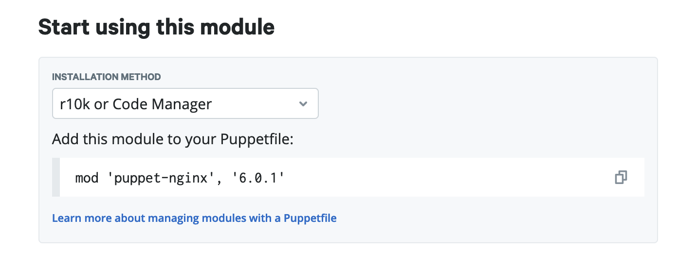
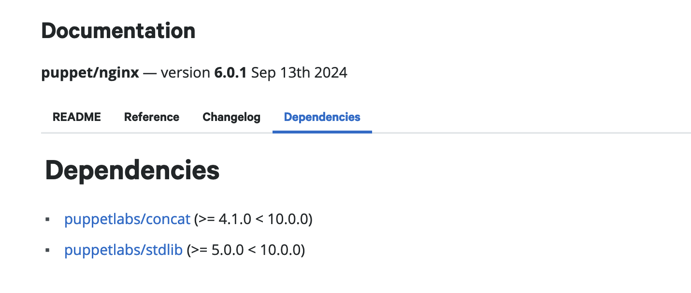
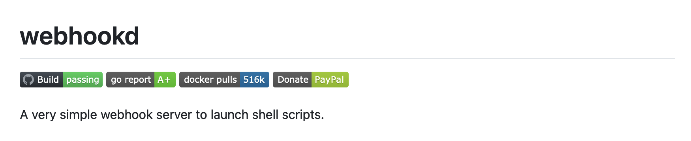

+++
title = 'Fully Automated Puppet Code Deployment Using r10k, Github Actions and Webhooks'
date = 2024-12-22T22:09:45+02:00
draft = false
ShowToc = true
ShowCodeCopyButtons = true
ShowReadingTime = true
ShowShareButtons = true

[cover]
image = "images/cover.png"
+++

I recently was gifted a few Dell Micro computer that I plan on using as my homelab in order to try different technologies and train myself on them. In order to do so I wanted to setup a fully working Puppet environment. I chose to go full DevOps on it and create a full system with a complete CI/CD which allows me to write Puppet code on my laptop and have it automatically deployed on the master server once commited. This article aims at providing you insights on how you can setup the same system for your Puppet setup.

## What we are trying to achieve

Before starting any project I love to make a little schema of what I'm trying to achieve. That's what I did in this case, to make sure that I was not missing anything.

What I want to achieve is to have my Puppet code automatically deployed to the Puppet server without having to do anything on it. I also want to make sure that it is linted before.

[](https://mermaid.live/edit#pako:eNpNkMFqhDAQhl8l5NQFhfbqoYdayy5tcdEuheJlVkcNaxIZE8pifPdGsy3NIczM_83wz8y81g3yhLeD_q57IMPeikox_05lVty1kLQQ2wmJnfy3Y3H8yFyojqhiJc4s1VIK44rsmN_4s9YXVuCoJ2E0XXdh4Aps_elhDlyHQD5bgp4eVtWVtq5xmhz7zJ72ef76X2TuBcRgCd1mL0g3LugfJLoOybHi4f7WukZBPNph2HzyiEskCaLxq88rVnHTo8SKJz5sgC4Vr9TiObBGl1dV88SQxYiTtl3Pvfth8pkdGzD4LKAjkH9VbNa938NltwNHfAT1pfUvs_wA8xZ3ew)

Let's go through this schema together : 

1. A user create a commit in the repository;
2. This commit will then trigger a CI;
3. If the CI fail, the user will do modification on the commit;
4. If the CI succeed we send a payload to a webhook;
5. The webhook itself trigger r10k;
6. r10k pulls the code, and it's now available on the server.

This solution is not really hard to put in place and it's why I chose it. All along this article we'll cover every aspect of it. Let's dive right in !

## r10k for the win

One of the big piece of this automation is called r10k. r10k is a CLI tool written by the Puppet team, and used to deploy environment from a version controlled system, in our case Git. 

As we'll see r10k can also be used with a file called a `Puppetfile`, a really great way to install new Puppet modules wether they're coming from the [official Puppet forge](https://forge.puppet.com) or your own git.

### r10k installation

Installing r10k is quite easy. But one thing that you should keep in mind is that it should be installed on the host that's hosting your Puppet server.

In my case I use Debian, and on Debian there's already a package for r10k. How great is that ? So installing it is really just as easy as running the following commands.

```bash
apt-get install -y r10k
```

And then to make sure that r10k is indeed installed and can correctly run.

```bash
r10k version
```

If you're not using Debian, you can follow the [official documentation](https://github.com/puppetlabs/r10k/blob/main/README.mkd) on how to get it installed.

### r10k configuration

The configuration of r10k is just as easy as installing it. The only thing is that I find the documentation to not be that great, and r10k being a "niche" application, you won't find much information on it on internet either. 

The commands are well documented, as they're describe by using the `r10k help` command. However the format of the configuration is not as well documented.

What I'm going to do is show you the configuration file I set-up and we'll analyze it together.

r10k use is YAML (like absolutely every DevOps tool nowadays) as it's configuration file format. Here's a look at mine :

```yaml
---
:cachedir: '/var/cache/r10k'

:sources:
  :main:
    remote: 'git@github.com:example/my-puppet-repo.git'
    basedir: '/etc/puppet/code/environments'
    private_key: '/etc/puppet/r10k/puppet_automation'
```

And let's go through it together so that you can understand each parameters.

| Name | Description |
| --- | --- |
| `:cachedir` | When r10k download modules or clone your code from the repository, it will use this folder as a cache in order to not have to download the whole thing again |
| `:sources` | This is where we define the list of sources, in my case I only have one, and you'll most likely have one too |
| `:main` | The name of my source, I went straightforward on my naming |
| `remote` | As you can see this is a git URL, this is where you'll specify your repository. Note that it should be in the format of the SSH URL, and not HTTPS as it is easier to handle this way |
| `basedir` | This is the folder where you want your code to be deployed, where the Puppet code lives |
| `private_key` | Because the project is most likely private, we use SSH to clone it and we use an SSH key in order to allow r10k to clone it |

> When you want to allow a specific SSH Key to git clone a specific project, you can do so by using ["deploy keys"](https://docs.github.com/en/authentication/connecting-to-github-with-ssh/managing-deploy-keys) in Github. The same logic should work too on GitLab.

The default location for this file configuration file is `/etc/puppetlabs/r10k/r10k.yaml`, but in newest Puppet version the `/etc/puppetlabs` does not exist anymore. However the r10k tool never changed the path it's default to.

I would highly recommend is to create a folder in the new path (`/etc/puppet/r10k`) so that all your Puppet configuration, including r10k, is stored within the same folder. Then when using the r10k tool, you should provide the path to this configuration file using the `-c/--config` parameter.

And just like that, r10k is ready to be used. But before starting to use it we'll see together how to write a Puppetfile so that you can use r10k to it's full potential !

# Creating a Puppetfile

As previously stated, a Puppetfile is a file in which you specify all the modules you want in your controlled environment, either they're local modules, from the official Puppet forge or from your own Git repositories. This file is the first one you should have when creating your Puppet version controled environment.

## Adding a module from the Puppet Forge

The Puppet Forge is a place where the community can share modules they've wrote so that other can also use them. When you're going to work in a Puppet environment, you will most likely encouter modules created, or at least maintained, by the "Vox Pupuli". As per their website, Vox Pupuli are a "collective of Puppet module, tooling and documentation authors". Those module can be used freely, and you can even contribute back to them if you see something that could be done better, or you encounter a bug.

Adding a Puppet Forge module to your Puppet environment is fairly easy. The first step will of course be to identify the module you want to use. As a demonstration purpose I will use the `nginx` module (a really well built and robust module by the way).

Once you're on the Puppet Forge website, simply navigate to the Puppet module you want to use. Here's the direct page to [the Nginx one](https://forge.puppet.com/modules/puppet/nginx).

By scrolling down a bit you will find a `Start using this module` section. That's what we're interested in.



Simply copy paste this text (the `mod ...`), and add it to your Puppetfile. 

Another thing you should also take into account is that sometimes Puppet modules will require other Puppet modules to work, as libraries. In the case of the Nginx module, we require a few. 

Just under the `Start using this module` section, you'll also find the `Documentation` section. From there you should navigate to the `Dependencies` pane, and add the other modules that are specified here.



In the end with all the dependencies, your Puppetfile should look somewhat like this.

```Puppet
mod 'puppetlabs-stdlib', '9.6.0'
mod 'puppetlabs-concat', '9.0.2'
mod 'puppet-nginx', '6.0.0'
```

### Handling the local modules case

You will most likely end up writing your own modules for cases where no modules already exist. In this case you will have two different ways to make use of them within your Puppet code, relying on your Puppetfile. 

This first option you might want to chose, although somewhat overkill, is to publish them to the Puppet Forge, or host your own Puppet Forge. I would not recommend this solution as it will be quite time consuming.

The second option would be to simply host them on Github, or whatever place you're using to store your code. 

In the former case you can declare them like you would for any other module hosted on Git directly. I describe how to do so further down this blog post.

In the later case you could just write them along your Puppet code. I worked with both cases, but I find the second one to be actually quite easier to manage, but I will still show you the two differents way to doing it.

#### Import a Puppet module from Git

Importing a module from Git is as simple as declaring it within your Puppetfile. However you have to take into account that the r10k application will actually clone the module, so make sure that the user running the r10k application does have access to the Git repositories if they're private !

As an example here's how you can import the same Nginx module, but from Git instead of the Puppet Forge.

```Puppet
mod 'nginx',
  :git => 'https://github.com/voxpupuli/puppet-nginx'
```

By default this will clone the module based on the master branch, but you can specify the specific branch you want to use using the `ref` option.


```Puppet
mod 'nginx',
  :git => 'https://github.com/voxpupuli/puppet-nginx',
  :ref => 'my_super_branch'
```

And you can also do it using tags, with the, quite obvious, `tag` parameter.

```Puppet
mod 'nginx',
  :git => 'https://github.com/voxpupuli/puppet-nginx',
  :tag => '6.0.0'
```

#### Declare a local Puppet module

If you decide to have your module within your local Git repository, you will have to declare them as `local` so that r10k actually keeps track of them.

Here's an example for modules I have within my Git repositories, and what it looks like in the Puppetfile.

```Puppet
mod 'common', local: true
```

> The common module is actually something I would recommend people using Puppet to create. When managing a huge fleet of servers you will most likely find yourself requiring specific setup on all of them, like installing zsh for example, or, in the case of my homelab, have my SSH key and user created everywhere.

### Using r10k to download our modules

Now that the modules you want to use are declared within a Puppetfile, you're ready to use r10k for the first time ! For now, and before we tackle the challenge of automating the code deployment, you'll use r10k by hand in order to sync up your modules. 

The following command is all that is required. In this case we're deploying the `production` environment, keep that in mind if you're working with another environment. I also like to set the output of r10k as verbose to get as much information as I can. And the `-m` option at the end tells r10k to deploy modules.

```Bash
r10k deploy environment production --verbose debug -m
```

> Remember that I made you change the path where the r10k configuration should be stored for consistency with newest Puppet version. If it's not at the default path, you should specify the location of the file with the `-c` parameter.

And just like that, voila ! 🥳🎉 Your modules are now being deployed within your Puppet code directory, and you can start to manage all your infrastructure using a properly Git versioned configuration !

## Going beyond : The fully automated code deployment

There's not much to do to achieve a fully automated deployment process. What's left to do will be split into two subsections : the creation of the webhooks to trigger r10k, and the creation of the Github Actions CI.

### Webhooks

Webhooks are a farily common way to work with things that needs to be "triggered" when something happens. They're commonly found on widely used applications, such as Slask for example if you've ever wanted a way to send a message to a channel, or with ServiceNow to create a ticket.

There is no official standard for webhooks. However in most of the case you can trigger webhooks by sending an HTTP `POST` method with the payload of the data to be processed by the webhook application. In the case of Slack for example the webhook actually contains the body of the messages and other misc things.

In our case we want to make use of the webhooks to trigger r10k. What we want to achieve is that each time someone pushes code to our Puppet code repository, the code is automatically synchronized on the Puppet server.

### Webhookd : From HTTP to Bash

One of the solution I like the most when working with webhooks, and when I need actions to be done on a server through webhooks, is called [Webhookd]("https://github.com/ncarlier/webhookd"). It's a solution that would probably deserve it's own article, but for now I'll just present it briefly, and show you how I use it for the Puppet code deployment.



> Before going any further I want to point out something really important : Webhookd can represent a huge security issue if not properly secured ! I will show you how to set-it up properly but just know that you're basically allowing the execution of bash script through HTTP ! This is the perfect open door for an attacker to basically do whatever he wants through RCE (Remote Command Execution).

#### Installation

To install it you can simply go on Github, download it and then extract it. The following command will actually do just this.

```bash
wget -O /tmp/webhookd.tar.gz https://github.com/ncarlier/webhookd/releases/download/v1.20.1/webhookd-darwin-amd64.tgz
tar -zxvf /tmp/webhookd.tar.gz --directory=/usr/bin/ webhookd
```

Then you can checkout if webhookd is correctly installed by running the following command.

```bash
webhookd -version
```

#### Configuration

The configuration I use is only composed of three parameters, but that's because I'm using Nginx as a reverse-proxy. Here's the configuration file in question.

```bash
WHD_LISTEN_ADDR="127.0.0.1:8080"
WHD_HOOK_SCRIPTS="/etc/webhookd/scripts"
WHD_PASSWD_FILE="/etc/webhookd/users.htpasswd"
```

You could also provide directly a certificate and private key to have it handle the TLS aspect. But in my case Nginx is handling this part.

```bash
WHD_TLS_ENABLED=true
WHD_TLS_KEY_FILE="/etc/webhookd/server.key"
WHD_TLS_CERT_FILE="/etc/webhookd/server.pem"
```

In order for webhookd to work as intended you have to do two more things : Create the `htpasswd` file to add basic authentication to it, and create a new service to have it runni as a proper daemon.

#### htpasswd file

You might wonder what a `htpasswd` file is and if you've never worked with "Basic Authentication" you will most likely never have encountered one. Basically a `htpasswd` file is a simple flat file used to store username and their associated password to then be used by an application.

Here is an example of what an `htpasswd` file look like.

```bash
user1:$2y$10$73vkQjjs8stSrNpPnLD6D.3coQ2NeRM8.E/N7DTqM5XHLiNtzo7oi
```

But how to create this file ? Well you could create it by hand, just by hashing the password and writing in a file with the format I gave you above. Or, you could also use the `htpasswd` command. This command is added by the package `apache2-utils`, so you should first install it.

```bash
apt-get install apache2-utils
```

Then simply run the following command, where `my-super-user` is actually the username that will be set in the file. Note the `-c` parameter which tell it create a new file. If the file already exist you should omit this parameter, as it will overwrite the entirety of the file.

```bash
htpasswd -B -c users.htpasswd my-super-renaud
```

#### Systemd service

In my case since I'm running Debian, and I'm not a "systemd hater", I use systemd to run all of my applications. Webhookd is no exception as I create a small service file for it to run as a daemon. Here's the snippet.

```bash
[Unit]
Description=A simple webhook daemon
After=network-online.target

[Service]
EnvironmentFile=/etc/webhookd/config
Type=simple
ExecStart=/usr/bin/webhookd
Restart=on-failure

[Install]
WantedBy=multi-user.target
```

> The configuration file for webhookd is actually not really a configuration file per se, but a list of environment variables. Because of this it should be passed as an environment file within the systemd service.

To add this service simply create a file called `webhookd.service` and paste the above content in it. Then reload the systemd daemon, enable the service, and start it.

```bash
vim /lib/systemd/system/webhookd.service
systemctl daemon-reload
systemctl enable webhookd.service
systemctl start webhookd.service
```

#### Creating your first script

Webhookd is basically used to run scripts upon HTTP POST request. The payload that is being sent is then expose as the first argument to each script being run (the `$1` argument in Bash). 

```bash
#!/bin/bash

# This will simply echo the payload
echo $1 
```

Each of the scripts you create within the script folder is what you will have to specify for the URI part of the address you're sending the request to. For example if you create a script `my_super_script.sh` at the root of your scripts folder, then you should send a POST request to the address `http://webhookd/my_super_script`. 

Here's a small script that simply output the sent body to a specific file in `/tmp`. Create this script by naming it `test_script.sh` within your scripts folder, and make sure it's executable (`chmod +x test_script.sh`).

```bash
#!/bin/bash

echo $1 > /tmp/test_file
```

Then by sending the following request to Webhookd using curl, you should see a file called `test_file` within the `/tmp` folder, and it should contain the sent body. Note the present of the `-u` parameter where we specify the username and the password to authenticate to Webhookd.

```bash
curl -u user:SuperPassword123! -H "Content-Type: application/json" -XPOST http://127.0.0.1:8080/test_script -d '{"hello": "world"}'
```

And then you can checkout the content of the file.

```bash
> cat /tmp/test_file
{"hello": "world"}
```

And that's how you can write as many webhooks as you want, to do whatever you want on the server you're deploying onto !

### A script to deploy your Puppet code

In our case, you guessed it, we will use to trigger r10k into deploying new Puppet code on the server.
The script I wrote to use r10k, with the Github Actions that we'll set up just after, is the following. 

```bash
#!/bin/bash

ENV_TO_DEPLOY=$(echo $1 | jq -r .env_to_deploy)
/usr/bin/r10k deploy environment $ENV_TO_DEPLOY --verbose debug -m > /tmp/r10k.log
```

You can then trigger this script, by sending the following JSON using curl (just like we did in our test before).

```json
{"env_to_deploy": "production"}
```

## Github Actions

Imagine a world where everyone follow standards and convention, without the need for those to be enforced... See how beautiful it is ? Well you can forget all about it. In the real world, people tend to be messy : their code will not follow conventions, they will access variables by a way they should not, and they won't even take the time to document their code properly.

Because of this you feel sad. You feel like you'll never be able to ensure your code base follows standards. But imagine there is a way to make sure that it does ? A way to make sure that this messy thing just never becomes a thing ? The answer to all your prayers exist : You need a CI !

In our specific case, the CI just make sense : No one should really deploy it's infrastructure code manually, it opens up the door for mistakes, and make the deployment take more time that it really needs. On top of that even tho I know how to write Puppet code, I like to have my code style enforced and double checked automatically.

Let's see how we can make use of Github Actions to speed up our infrastructure deployment process.


Since you're reading this blog post I will assume that you're already familiar with CI/CD and you get the idea about how they work. However, like me before writing this blog post, you might never have used Github Actions before. I won't cover how Github Actions work, compared to Gitlab CI for example, but all I can say is that it's fairly easy to do, and I'll share with you my `.yaml` Github Actions file so you can get started using it right away. 

I will still take the time to explain it however, as I don't like giving people the answer without them knowing what they're copying/pasting : I'm not an LLM.

### What to do in a CI

The first question you should ask yourself when writing code, and setting up a CI, is what you want to do with your CI. In most cases, if it's "classic code" (ie. not IaC), you will most likely want to do the following : 
- Lint the code : To make sure that it follows a certain standard (such as PEP8 for Python).
- Test the code : By running all the unit and E2E tests wrote by the developers.
- Check for vulnerabilities : With a SAST tool that can check if your code is susceptibile to vulnerability such as usage of MD5 for password hashing, command injection...
- Build the code : So it can be shipped, either through containers, or Debian packages for example.
- Release the code : By uploading the built version where it needs to be uploaded.

In the case of the CI I'm setting up, I will only do the two followings : 
- Lint the code.
- Release the code.

Since I'm using r10k, I don't need to actually build the code, as the fact that it is commited to the repository, makes it already available to the Puppet server. I'm also not running tests, as setting this up is a subject of it's own when it comes to IaC code.

#### A simple linting job

When writing Puppet code, you have to follow "best practices" that will ensure that all of the code looks the same throughout your repository. Even better it will also enfore the documentation of your modules, as well as prevent small occasional bug (such as the usage of single quotes instead of double quotes, which in Puppet code means a totally different thing).

The tool you're going to use to lint your code is simply called `puppet-lint`. This small CLI tool will simply run on each file you tell him to (or on an entire directory) and output any linting errors it might found.

Without letting you wait anymore, here's a small Github Action that you can use to do this.

```yaml
name: Puppet

on:
  push:
    branches: [ "production" ]
  pull_request:
    branches: [ "production" ]

jobs:
  # Check for linting errors within Puppet code
  lint:
    runs-on: ubuntu-latest
    container:
      image: debian:bookworm
    steps:
      - uses: actions/checkout@v4
      - run: apt-get update && apt-get -y install puppet-lint
      - run: puppet-lint $GITHUB_WORKSPACE
```

Let's go through what it does together.

```yaml
name: Puppet
```

The first line simply give this action his name. In our case, quite soberly, `Puppet`.

---


```yaml
on:
  push:
    branches: [ "production" ]
  pull_request:
    branches: [ "production" ]
```
The next code block defines on which cases we want this action to run.

It should be read as the following : 
- Code is pushed to the `production` branch (which is the default Puppet environment)
- In Puppet request that are going to be pushed on the `production` branch.

---

```yaml
jobs:
  lint:
    runs-on: ubuntu-latest
    container:
      image: debian:bookworm
    steps:
      - uses: actions/checkout@v4
      - run: apt-get update && apt-get -y install puppet-lint
      - run: puppet-lint $GITHUB_WORKSPACE
```

This code block is actually what does the action. It's where we define the jobs. In our case only one job exist : `lint`.

It does the following : 
- It will run using the `ubuntu-latest` runner
- The image it uses to run is `debian:bookworm` (this is an official Docker image)
- Then it runs the following steps :
  - First it gets the code from Github, as by default, it does not have the code.
  - Then it install the `puppet-lint` tool. This is not required if the Docker image you use already has the `puppet-lint` tool installed.
  - Finally, it runs the `puppet-lint` tool on the folder containing your code. The `$GITHUB_WORKSPACE` variable is an environment variable containing the path to which the checkout branch downloaded the code.

> You may have noticed that I install the `puppet-lint` tool each time. This is suboptimal as he actually takes the CI longer to run for no reason. And it can also lead to error as the version of the tool is not fixed. You should definetely not do this, and have an already existing docker image with all the tools you need installed.

---

All of this code now should be added to a file at this specific location within your repository : `.github/workflows/puppet.yml`.

#### What about the deployment process ?

In order to trigger Webhookd into deploying our code, we just have a really simple thing to do : sending a curl request. Yup, it's that easy.

Here's the code I use to do so, it's a little bit complex so I'll explain it deeply. Note that this code is actually a job, and not an entire Github Actions file. Just like for the lint job just before, it uses the `ubuntu-latest` runner, and the `debian:bookworm` docker image.


```yaml
  deploy:
    runs-on: ubuntu-latest
    container:
      image: debian:bookworm
    steps:
      - name: Update deb list and install required packages
        run: apt-get update && apt-get -y install curl jq
      - name: Send payload
        env:
         GITHUB: ${{ toJson(github) }}
         PUPPET_DEPLOYMENT_USERNAME: ${{ secrets.PUPPET_DEPLOYMENT_USERNAME }}
         PUPPET_DEPLOYMENT_PASSWORD: ${{ secrets.PUPPET_DEPLOYMENT_PASSWORD }}
        run: >
          ENV_TO_DEPLOY=$(echo $GITHUB | jq -r .head_ref) &&
          curl --fail -u $PUPPET_DEPLOYMENT_USERNAME:$PUPPET_DEPLOYMENT_PASSWORD \
            -H "Content-Type: application/json" https://webhook.example.org/puppet/deploy_env \
            -d '{"env_to_deploy": "'$ENV_TO_DEPLOY'"}'
    needs:
      - lint
```

The first step simply update the apt repositories and install `curl` as well as `jq`. `curl` will be used to send HTTP requests, and `jq` to parse JSON within bash. Just like for the `puppet-lint` tool, you should use a Docker image which already have those tools installed.

The second step is where we actually send the payload. One important thing to note is that it has an `env` variable, this is because we need to give him extra variables. In our case those variables are the Github context as well as the Puppet deployment username and the password (those are the Webhookd credentials). The last two are actually Github secrets that you can add to your repository following [this documentation](https://docs.github.com/en/actions/security-for-github-actions/security-guides/using-secrets-in-github-actions).

The command that is actually being ran is composed of two commands (notice the `&&` between the two). The first command will get the environment (ie. the name of the branch) to use in the second command. And the second command is a curl command.

The curl command is composed of quite a few parameters that I want to explain one by one.

- `--fail` : This parameter allow the command to fail. By default, whatever the HTTP status code the curl command receive, it will still return `0`. But in our case, if for some reason we're not able to send the request, we want our CI to fail. The addition of this argument tell curl to return `1` as exit code if the status code is not considered OK (ie. between 200 and 299).
- `-u $PUPPET_DEPLOYMENT_USERNAME:$PUPPET_DEPLOYMENT_PASSWORD` : When using basic authentication, this is what allows you to give those credentials to curl.
- `-H "Content-Type: application/json"` : An important header for most API to specify which type of data you're sending. In this case we send JSON.
- `-d '{"env_to_deploy": "'$ENV_TO_DEPLOY'"}'` : This parameter tells the data that we want to send. In our case we send a simple JSON, to be interpreted by the webhoookd script, which contains the key of the environment to deploy.

Finally you will notice the ending code block (`needs: [lint]`). This is because we don't want this job to run if the linting fail. By adding this code block we specify that the deploy job can only run if the lint job was successful.

Here's the entire file for the Github Actions I use.


```yaml
name: Puppet

on:
  push:
    branches: [ "production" ]
  pull_request:
    branches: [ "production" ]

jobs:
  # Check for linting errors within Puppet code
  lint:
    runs-on: ubuntu-latest
    container: 
      image: debian:bookworm
    steps:
      - uses: actions/checkout@v4
      - run: apt-get update && apt-get -y install puppet-lint 
      - run: puppet-lint $GITHUB_WORKSPACE

  # Send webhook payload to r10k for deployment
  deploy:
    runs-on: ubuntu-latest
    container:
      image: debian:bookworm
    steps:
      - name: Update deb list and install required packages
        run: apt-get update && apt-get -y install curl jq
      - name: Send payload
        env: 
         GITHUB: ${{ toJson(github) }}
         PUPPET_DEPLOYMENT_USERNAME: ${{ secrets.PUPPET_DEPLOYMENT_USERNAME }}
         PUPPET_DEPLOYMENT_PASSWORD: ${{ secrets.PUPPET_DEPLOYMENT_PASSWORD }}
        run: >
          ENV_TO_DEPLOY=$(echo $GITHUB | jq -r .head_ref) &&
          curl --fail -u $PUPPET_DEPLOYMENT_USERNAME:$PUPPET_DEPLOYMENT_PASSWORD \
            -H "Content-Type: application/json" https://webhook.example.org/puppet/deploy_env \
            -d '{"env_to_deploy": "'$ENV_TO_DEPLOY'"}'
    needs:
      - lint

```


## Conclusion

Setting up this kind of CI/CD is the first step between you and a fully automated world. Having such setup in place will only make your life easier, as you can concentrate on what actually matters : Shipping to production.

Of course today I only showed you how to deploy Puppet code, and lint it. But in the future you could also add some unit testing that are possible to be created within your own Puppet module.

Personnaly I do not see any other way to do my work. By spending less time on deploying my code, I can just concentrate on building out my infrastructure. I also hope that this article brighten your views on how you can automate all of your processes.


Thanks for reading out this blog post, and stay tuned for the next one !
